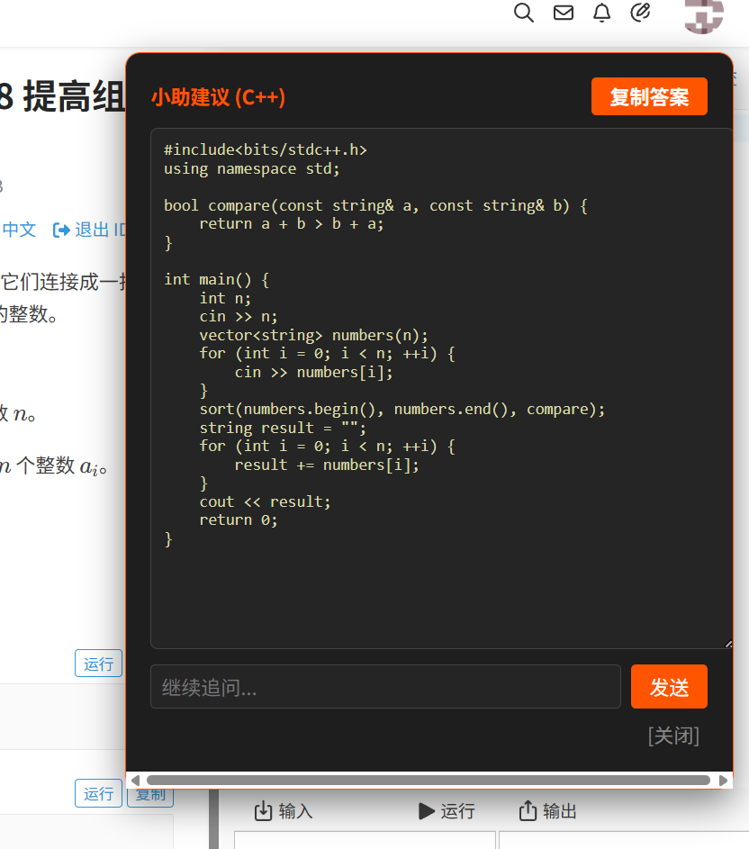
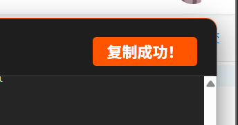
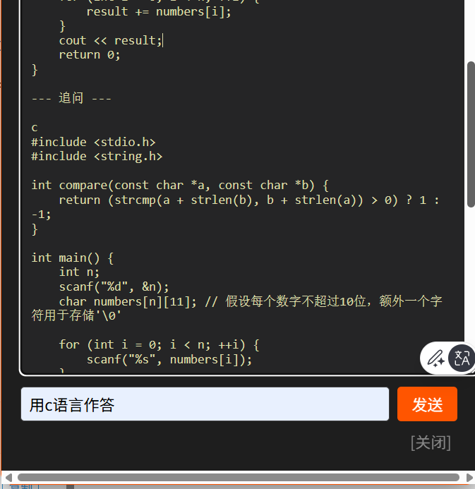
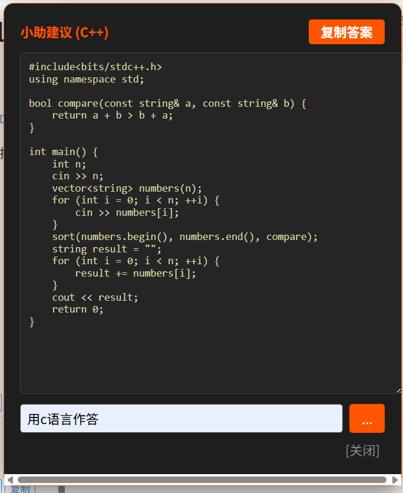

# 自动答题脚本

一个支持洛谷、EduCoder 等 OJ 平台题目抓取的 AI 辅助解题工具。一键召唤 C++ 代码解答，支持拖拽悬浮按钮与追问交互。

---

## 项目结构

```
.
├── backend/
│   └── main.py          # FastAPI 后端服务
├── userscript/
│   └── xiaozhu.user.js  # Tampermonkey 油猴脚本
└── README.md
```

---

## 功能特性

| 特性 | 说明 |
|:---|:---|
|  **智能抓取** | 自动识别洛谷、EduCoder 等平台题目内容 |
|  **C++ 解答** | 基于 GLM-4-Flash 模型生成标准 C++ 代码 |
|  **一键召唤** | 悬浮按钮，支持拖拽定位 |
|  **追问模式** | 支持在面板中继续提问，追加代码 |
|  **一键复制** | 快速复制生成的代码到剪贴板 |
|  **历史记录** | 自动保存问答记录到 `history.md` |

---

## ✨ 项目技术

- 基于 FastAPI 搭建本地 AI 解题服务，实现前后端分离
- 使用 Tampermonkey 脚本自动抓取 OJ 页面题目内容
- 通过 OpenAI SDK 对接 GLM-4-Flash，实现代码生成
- 使用 history 列表实现多轮上下文对话
- 支持悬浮按钮拖拽、追问交互与代码追加显示
- 使用 Markdown 持久化保存历史记录

---
## 项目截图

### 悬浮按钮


### 悬浮面板


### 复制成功


### 追问


### 回答


---

## 技术栈

- **前端**：Tampermonkey 用户脚本（原生 JavaScript）
- **后端**：Python + FastAPI
- **AI 模型**：智谱 GLM-4-Flash（通过 OpenAI SDK 调用）

---

## 快速开始

### 1. 后端部署

#### 环境要求

- Python 3.8+
- 智谱 AI API Key（[获取地址](https://open.bigmodel.cn/)）

#### 安装依赖

```bash
pip install fastapi uvicorn python-dotenv openai
```

#### 配置环境变量

在项目根目录创建 `.env` 文件：

```env
API_KEY=your_zhipu_api_key_here
```

#### 启动服务

```bash
uvicorn main:app --host 127.0.0.1 --port 8000 --reload
```

服务启动后访问 `http://127.0.0.1:8000/` 查看运行状态。

---

### 2. 前端安装

1. 安装浏览器插件 [Tampermonkey](https://www.tampermonkey.net/)
2. 点击插件图标 → **添加新脚本**
3. 将 `xiaozhu.user.js` 完整代码粘贴进编辑器
4. 按 `Ctrl+S` 保存

> **匹配站点**：支持 `luogu.com.cn`、`educoder.net` 及所有网页（`@match *://*/*`）

---

## API 文档

### `POST /solve`

请求解题接口。

**请求体**：
```json
{
  "question": "题目描述文本..."
}
```

**响应体**：
```json
{
  "answer": "#include<bits/stdc++.h>\nusing namespace std;\nint main() {...}"
}
```

### `GET /`

健康检查接口，返回服务状态。

---

## 使用说明

### 基本流程

1. 打开任意支持的 OJ 题目页面
2. 点击右下角橙色悬浮按钮 **「召唤小助」**
3. 等待 AI 生成代码，右侧弹出黑色面板
4. 点击 **「复制答案」** 一键复制代码
5. 在输入框中输入追问内容，点击 **「发送」** 继续提问

### 拖拽功能

- 按住悬浮按钮可拖拽到页面任意位置
- 释放后自动固定新位置

---

## 系统提示词（System Prompt）

后端自动注入以下角色设定：

> 你是一个 C++ 编程大神。请直接给出题目的 C++ 完整代码解答。不要注释，头文件用 `#include<bits/stdc++.h> using namespace std;`，符合标准 C++ 规范。

---

## 注意事项

⚠️ **安全提醒**
- 脚本使用 `@grant GM_xmlhttpRequest` 进行跨域请求，确保 Tampermonkey 已授予权限
- 生产环境建议将 CORS `allow_origins=["*"]` 限制为具体域名

⚠️ **模型限制**
- 当前使用 `glm-4-flash` 模型，代码质量取决于题目复杂度
- 复杂算法题建议结合人工审查

⚠️ **历史记录**
- 问答记录以 Markdown 格式追加写入 `history.md`
- 历史记录仅保存在内存中，服务重启后 `history` 列表清空，但文件记录保留

---

## 开发计划

- [ ] 支持更多 OJ 平台（Codeforces、AtCoder 等）
- [ ] 添加代码高亮与语法检查
- [ ] 支持多语言切换（Python、Java 等）
- [ ] 历史记录持久化到数据库

---

## 作者

**Cyrivea**

---

## 许可证

MIT License
